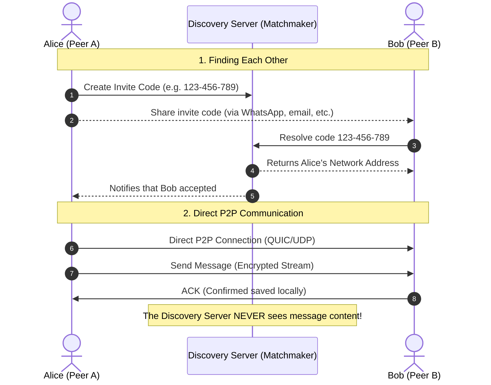

# GoChat

A lightweight, terminal-based peer-to-peer (P2P) chat written in Go, powered by [libp2p](https://libp2p.io) and QUIC.

In **GoChat**, your conversations never touch a central server. Messages travel directly from your computer to your peer's computer. The central server exists **only** as a lightweight matchmaker to help peers discover each other's network addresses.

---

<!-- Replace this with your screenshot or GIF -->
<p align="center">
  
</p>

---

## 💡 How It Works

GoChat separates **peer discovery** from **actual communication**:



### 1. Cryptographic Identity
When you launch GoChat for the first time, it generates an Ed25519 cryptographic key pair locally on your machine (`~/.gochat/identity.key`). Your unique **PeerID** is derived directly from this key.

### 2. The Matchmaker (Discovery Server)
Connecting two computers over the internet directly is tricky due to routers and firewalls (NAT). The Discovery Server solves this:
* **Heartbeats**: Peers periodically send their connection candidates (IP and UDP port) to the discovery server so they can be reached.
* **Address Observer**: An auxiliary observer checks the public IP and UDP port seen from outside, helping peers know how they appear to the world.
* **Invites**: Users generate short invite codes (e.g., `ABC-DEF-GHI`, valid for 10 minutes) to pair with friends without having to type complex IP addresses.

### 3. Direct Message Delivery & Offline Safety
Once two peers know each other:
* **100% Peer-to-Peer**: Every message travels directly over a libp2p QUIC stream (`/gochat/2.0.0`).
* **Local Persistence ([bbolt](https://github.com/etcd-io/bbolt))**: Messages, contacts, and chat history are stored in a private embedded database on your disk (`~/.gochat/gochat.db`).
* **Outbox & Delivery Guarantee**: Messages are saved locally before network transmission. If your peer is temporarily unreachable, messages remain queued in your local outbox and will automatically retry when connected.
* **Persistence ACKs**: When a peer receives a message, it immediately writes it to local disk and returns an acknowledgment (ACK). The sender only marks the message as *delivered* once this ACK is received.

---

## 🛠️ Tech Stack

* **Language:** [Go](https://go.dev/) (1.27+)
* **P2P Networking:** [libp2p](https://github.com/libp2p/go-libp2p) with QUIC v1 transport over UDP
* **Terminal UI:** [Bubble Tea](https://github.com/charmbracelet/bubbletea) & [Lipgloss](https://github.com/charmbracelet/lipgloss)
* **Local Storage:** [bbolt](https://github.com/etcd-io/bbolt)
* **Signaling/Discovery Backend:** Go HTTP API + [Redis](https://redis.io/)

---

## 🚀 Getting Started

### Prerequisites

* Go installed (1.23+)
* Docker & Docker Compose (optional, for running your own discovery server)

### 1. Running the Discovery Server

You can run the discovery server and Redis locally using Docker Compose:

```bash
docker compose up -d
```

Or configure a remote discovery server in `.env.chat`.

### 2. Running GoChat Client

Create your configuration file from the example:

```bash
cp .env.chat.example .env.chat
```

Ensure `.env.chat` points to your discovery server:
```env
DISCOVERY_URL=http://localhost:8080
```

Start the chat interface:

```bash
go run ./cmd/gochat
```

---

## ⌨️ TUI Navigation

| Key | Action |
|---|---|
| `↑` / `↓` or `k` / `j` | Navigate through contacts |
| `Enter` | Open conversation |
| `i` | Generate a new invite code |
| `a` | Add a friend via invite code |
| `Esc` | Return to contacts list |
| `q` | Quit the application |

---

## 🔒 Privacy & Architecture Note

* **No server-side chat logs**: The discovery server does not have endpoints or database tables to store, read, or route chat messages.
* **Direct peer connections**: If the connection between peers cannot be established due to extreme NAT/firewall conditions, the message fails safely in your local outbox rather than falling back to an unencrypted or third-party server relay.
